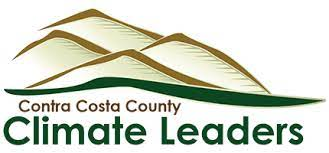

```{r setup, include=FALSE}
knitr::opts_chunk$set(echo = TRUE)
```



```{r, include=FALSE}

library(tidyverse)
library(ggplot2)
library(plotly)
library(dplyr)
library(htmlwidgets)
library(jsonlite)
library(leaflet)
library(janitor)
library(ggthemes)
library(plotly)
library(rjson)
```


```{r,include=FALSE}
#not sure why but I had to add another dot to the path
library(readxl)
zev_sales_county <- read_excel("../02_inputs/New_ZEV_Sales_Last_updated_01-18-2023.xlsx", sheet = "County") %>% 
  clean_names()
```

Electric Vehicles (EVs) are revolutionizing the transportation industry by offering an environmentally-friendly alternative to traditional gasoline-powered vehicles. As EVs become more mainstream, understanding the trends and challenges of EV adoption and charging infrastructure is crucial for policymakers, researchers, and EV enthusiasts alike. In this report, we present a comprehensive analysis of new EV sales in California by city and county(with a particular focus on Contra Costa County), featuring interactive graphs that show new EV sales data standardized by the number of cars in those respective cities and counties. We also provide detailed information on EV chargers in each city, including a map of public charger locations, and highlight the federal electric bus program, which is driving the transition to zero-emission buses. All of the data used in this report is sourced from publicly available datasets, ensuring transparency and accountability. Whether you are a policy maker looking to advance sustainable transportation policies, a researcher seeking to understand the latest trends in EV adoption, or an EV enthusiast wanting to stay informed about charging infrastructure, this report is an essential read. Join us on this journey as we explore the latest developments in the EV landscape and the opportunities and challenges that lie ahead.

In addition to new EV sales and charging infrastructure data, this report also includes graphs on key factors related to the EV landscape. This includes the average cost of ownership, battery material sourcing, car fires, and well-to-wheel emissions. By providing a comprehensive analysis of these factors, the report offers a holistic view of the EV landscape in California and empowers readers to make informed decisions about the future of sustainable transportation.

## Contra Costa County City Electric Transportation Rankings
```{r, echo=FALSE}
plotly_obj_scores_ev <- readRDS(file = "plotly_obj_scores_ev.rds")
plotly_obj_scores_ev
```

## ZEV sales for each city Standardized by number of cars registered in the city
```{r, echo=FALSE}
#This is a standardized ZEV sales for each city in the county
ZEV_sales_city_standardized_elect <- readRDS(file = "ZEV_sales_city_standardized_elect.rds")  %>% 
  mutate(city = case_when(city == "Unincorporated Contra Costa County" ~ "Uninc CCC",
                          TRUE ~ city))

plot_ly(ZEV_sales_city_standardized_elect, x = ~city, y = ~ev_per_total_vehicle_scaled, name = "EV Score", type = "bar", showlegend = FALSE, marker = list(line = list(color = "black", width = 1))) %>%
  add_trace(y = ~total_vehicles, name = "Total EV Sold", type = "bar", visible = FALSE) %>%
  layout( 
    updatemenus = list(
      list(
        type = "buttons",
        direction = "down",
        showactive = TRUE,
        buttons = list(
          list(method = "update",
               args = list(list(visible = c(TRUE, FALSE))),
               label = "EV Score"),
          list(method = "update",
               args = list(list(visible = c(FALSE, TRUE))),
               label = "Total EV Sold"
          )
        ),
        pad = list(r = 15, t = 0, b = 0, l = 0)
      )
    ),
    xaxis = list(title = "City", tickfont = list(size = 14), tickangle = 45),
    yaxis = list(title = "", tickfont = list(size = 14)),
    margin = list(l = 60, r = 20, t = 40, b = 40),
    font = list(family = "Arial", size = 14)
  )

```

The presented graph displays a ranking of 2022 Zero Emission Vehicle (ZEV) car sales, standardized by the number of cars in each city. The data used for this graph was sourced from the California Energy Commission (CEC)

## Charging Stations per car registered in each city
```{r, echo=FALSE}
EV_stations_standardized <- readRDS(file = "EV_stations_standardized.rds")  %>% 
  mutate(city = case_when(city == "Unincorporated Contra Costa County" ~ "Uninc CCC",
                          TRUE ~ city))

plot_ly(EV_stations_standardized, x = ~city, y = ~chargers_per_total_vehicle_scaled, name = "Stations Score", type = "bar", showlegend = FALSE, marker = list(line = list(color = "black", width = 1))) %>%
  add_trace(y = ~total_stations, name = "Total Stations", type = "bar", visible = FALSE) %>%
  layout( 
    updatemenus = list(
      list(
        type = "buttons",
        direction = "down",
        showactive = TRUE,
        buttons = list(
          list(method = "update",
               args = list(list(visible = c(TRUE, FALSE))),
               label = "EV Score"),
          list(method = "update",
               args = list(list(visible = c(FALSE, TRUE))),
               label = "Total Stations"
          )
        ),
        pad = list(r = 15, t = 0, b = 0, l = 0)
      )
    ),
    xaxis = list(title = "City", tickfont = list(size = 14), tickangle = 45),
    yaxis = list(title = "", tickfont = list(size = 14)),
    margin = list(l = 60, r = 20, t = 40, b = 40),
    font = list(family = "Arial", size = 14)
  )

```

This graph ranks the cities of Contra Costa County on the number of Charging stations per car in their city. Data collected from the Alternate fuel database.

```{r, echo=FALSE}
plotly_obj_buses <- readRDS(file = "plotly_obj_buses.rds")
#brentwood EV Bus program
plotly_obj_buses
```
The California Energy Commission (CEC) has launched the School Bus Replacement Program, which aims to replace California's oldest diesel buses with all-new battery electric buses and install supporting charging infrastructure. 
In addition to the School Bus Replacement Program, the California Air Resources Board (CARB) provides funding for electric school buses and supports the transition to a zero-emission school bus fleet. Data on those recipients has not been included in this report. If you know how/where to get that information please reach out.

## Map of Public EV chargers in Contra Costa County
```{r, echo=FALSE, fig.width=5, fig.height=5, fig.align="center"}
map_of_EV_small_ccc <- readRDS( file = "map_of_EV_small_ccc.rds")
map_of_EV_small_ccc
```

# Common Counterpoint in EV Adoption

## Average Cost of Ownership
```{r}
#going to make a summary graph with the 4 cars that they have in it
```
Calculate your cost of Ownership https://atlaspolicy.com/fleet-procurement-analysis-tool/

## Car Fires
```{r, , echo=FALSE, fig.width=4.5, fig.height=2.5}
fig_car_fire <- readRDS( file = "fig_car_fire.rds")
fig_car_fire
```

# California County Level Breakdown

## 2022 ZEV sales by County
```{r, echo=FALSE}
zev_plot <- zev_sales_county %>%
  group_by(county) %>%
  summarise(total_sales = sum(number_of_vehicles)) %>%
  plot_ly(x = ~county, y = ~total_sales, type = "bar",
          marker = list(color = "#636EFA")) %>%
  layout(xaxis = list(title = "County", showgrid = FALSE),
         yaxis = list(title = "Total Number of Vehicles", showgrid = FALSE),
         title = "Total Zero-Emission Vehicle Sales by County",
         margin = list(l = 100, r = 100, t = 100, b = 100),
         plot_bgcolor = "#F4F4F4",
         paper_bgcolor = "#F4F4F4",
         font = list(family = "Helvetica Neue"))

zev_plot
```
## Well to Wheel CO2 Emission from the DoE
<iframe src="https://widgets.nrel.gov/afdc/electricity-sources-and-emissions/#/?afdc=true&show_state=ca" id="afdc-eset" frameborder="0" scrolling="no" width="100%" height="auto"></iframe><script type="text/javascript">window.addEventListener('message',(event)=>{if(event&&event.data&&event.data.type==='resize-embed-afdc-eset'){document.getElementById("afdc-eset").height=event.data.height;}});</script>

## Data Description and Citation

The data used in this analysis includes the following:

- Alternative Fuel Station Locations: This dataset includes the locations of alternative fuel stations in the United States, including electric charging stations, compressed natural gas stations, and hydrogen fueling stations. This data was obtained from the Alternative Fuels Data Center (AFDC) and can be downloaded at https://afdc.energy.gov/data_download/.

- Zero-Emission Vehicle (ZEV) Sales: This dataset includes annual sales data for new ZEVs, including battery electric vehicles and fuel cell electric vehicles, in California. This data was obtained from the California Energy Commission (CEC) and can be downloaded at https://www.energy.ca.gov/data-reports/energy-almanac/zero-emission-vehicle-and-infrastructure-statistics/new-zev-sales.

- Vehicles in Each City: This dataset includes the number of vehicles in each city in California. The data was obtained from the American Community Survey 2022.

When using this data, please cite the following sources:

- Alternative Fuels Data Center (AFDC). (2022). Alternative Fuel Station Locations [Data file]. Retrieved from https://afdc.energy.gov/data_download/

- California Energy Commission (CEC). (2022). Zero-Emission Vehicle (ZEV) Sales [Data file]. Retrieved from https://www.energy.ca.gov/data-reports/energy-almanac/zero-emission-vehicle-and-infrastructure-statistics/new-zev-sales

- United States Census Bureau. (2022). American Community Survey 2022 [Data file]. Retrieved from https://www.census.gov/programs-surveys/acs/data.html
If you have any questions or comments about this report or the data sources used, please feel free to reach out to the author at Ajohns2050@gmail.com.

