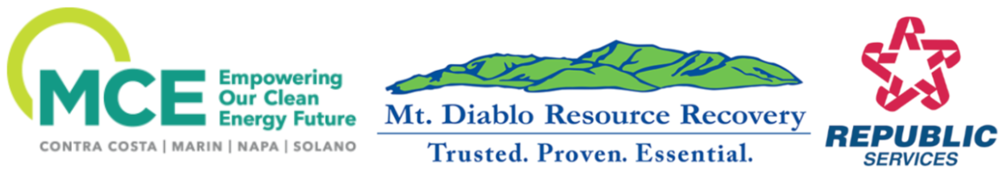

---
output:
  html_document:
    toc: true
    toc_depth: 3
    toc_float: true
---

```{r setup, include=FALSE}
knitr::opts_chunk$set(echo = TRUE)
```


# **Advantages of Opting for MCE**

- MCE offers a range of clean energy alternatives, such as 60% and 100% renewable sources.
- By choosing MCE, customers can enjoy competitive and consistent pricing, while also reaping invaluable environmental advantages.
- MCE actively invests in the community through local energy initiatives, workforce development, and various programs.
- Opting for MCE grants customers the power of local control over electric generation service options and rates.

For more information: Visit the MCE Website

```{r, include=FALSE , warning=FALSE}

library(tidyverse)
library(ggplot2)
library(plotly)
library(dplyr)
library(htmlwidgets)
library(jsonlite)
library(leaflet)
library(janitor)
library(ggthemes)
library(plotly)
library(rjson)
```
## **Contra Costa County County Cities and their MCE Score**
```{r, echo=FALSE , warning=FALSE}
# filter to see each of the aspects and how they stack up to get the score
MCE_score <- readRDS( file = "021_MCE_score.rds")
MCE_score
```
80 Percent of Contra Costa County Cities are actively enrolled in MCE. 
- Scores here give 50 points for being enrolled 
- 25 points for having the city municipality enrolled in Deep Green. (MCE's 100 percent renewable energy option). 
- 25 points are awarded based on local Enrollment participation rates with the leading city getting all 25 points and each city getting a portion of the 25 points based how they compare to the leading city. 


## **MCE Participating Cities**
```{r, echo=FALSE}
map_cities_in_MCE <- readRDS( file = "027_map_cities_in_MCE.rds")
map_cities_in_MCE
```


# **Rankings**
MCE services more then just Contra Costa County.

## **County Average Participation Rates**
```{r, echo=FALSE}
county_part_averages <- readRDS( file = "023_county_part_averages.rds")
county_part_averages
```
This excludes non participating cities.

## **County Average Deep Green Rates**
```{r, echo=FALSE}
county_deep_averages <- readRDS( file = "023_county_deep_averages.rds")
county_deep_averages
```
This excludes non participating Cities.

## **CO2 Reduced All Cities**
```{r, echo=FALSE , fig.width= 8}
MCE_co2_reduced <- readRDS( file = "022_MCE_co2_reduced.rds")
MCE_co2_reduced
```
This amount to CO2 is equivalent to:

Cars: On average, a passenger vehicle emits approximately 4.6 metric tons of CO2 per year. Therefore, 20,000 MT of CO2 emissions is equivalent to the annual emissions of approximately 4,348 cars.

Homes: The average annual CO2 emissions from a U.S. household are around 7.5 metric tons. Consequently, 20,000 MT of CO2 is roughly equivalent to the annual emissions of 2,667 households.

MT CO2 reduced is based on 2010-2020 averages of MCE compared to standard PG&E emissions. Used for illistrative purposes.

# **MCE in Action**

MCE (Marin Clean Energy) is a remarkable energy provider that exemplifies its mission through various local renewable projects and sustainable initiatives. Here's an overview of the projects mentioned and why they demonstrate MCE's commitment to clean energy and community engagement:

- Local Workforce and Union Labor: MCE ensures that its local projects over 1 MW are built with union labor. By prioritizing local workers, MCE supports the local economy, creates job opportunities, and fosters community development.

- Feed-In Tariff Program: MCE's Feed-In Tariff program requires prevailing wage and 50% local hire for projects. This commitment to fair wages and local employment promotes social equity and ensures that the benefits of renewable energy projects are shared within the community.

- Solar PV System with EV Charging: MCE's 10th local renewable project is an 80kW PV solar system that powers 10 public electric vehicle (EV) charging ports. This project not only generates renewable energy but also promotes the adoption of electric vehicles by providing accessible charging infrastructure. It showcases the integration of solar energy and sustainable transportation, reducing dependence on fossil fuels.

- Pollinator-Friendly Solar Projects: MCE's solar projects require pollinator-friendly groundcover, demonstrating a commitment to environmental stewardship and biodiversity conservation. Incorporating native plants that support pollinators helps create habitats and restore ecological balance, contributing to the overall health of the ecosystem.

- MCE Solar Charge: MCE Solar Charge stations offer 100% renewably-powered EV charging. By utilizing energy from the solar array and MCE's Deep Green 100% renewable energy, these charging stations prioritize clean energy usage, reducing carbon emissions associated with transportation and promoting sustainable mobility.

- Landfill Gas-to-Energy at Redwood Landfill: MCE, in partnership with Waste Management, operates a landfill gas-to-energy plant. This innovative facility harnesses methane gas produced at the Redwood Landfill to generate electricity. By converting a potent greenhouse gas into a renewable energy source, MCE and Waste Management exemplify sustainable waste management practices and contribute to the circular economy.

- Environmental Benefits and Emissions Reduction: MCE's landfill gas-to-energy plant incorporates a sophisticated scrubbing system that minimizes emissions, making it nearly emissions-free. This exemplifies MCE's commitment to reducing environmental impact and finding sustainable solutions for energy generation.

# **Data Description and Citation**

The data used in this analysis is provided directly from MCE in 2023.
Additional data found here:
https://www.mcecleanenergy.org/service-area/

# **Our Sponsors**
