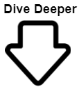

```{r setup, include=FALSE}
knitr::opts_chunk$set(echo = TRUE)
```

```{r, include=FALSE}

library(tidyverse)
library(ggplot2)
library(plotly)
library(dplyr)
library(htmlwidgets)
library(jsonlite)
library(leaflet)
library(janitor)
library(ggthemes)
library(plotly)
library(rjson)
library(tidyverse)
library(ggplot2)
library(plotly)
library(readxl)
library(lubridate)
```

# **Introduction**
Fellowship and job training programs play a vital role in equipping the next generation with the knowledge, skills, and passion necessary to address the pressing environmental challenges we face. By providing students with a comprehensive understanding of sustainability principles, they can develop innovative solutions to reduce waste, conserve resources, promote renewable energy, and mitigate the impacts of climate change. Through experiential learning, these fellows can gain practical experience and collaborate with experts in various sustainability fields, fostering their critical thinking abilities and nurturing a deep sense of responsibility towards the environment. 
By investing in the education and training of students through this initiative, we lay the foundation for a sustainable future that values the well-being of both people and the planet.

All data used is sourced from publicly available data sets, ensuring transparency and accountability.

# **Scores**

## Civic Spark and Climate Action Fellows Scores

```{r, echo=FALSE, warning = FALSE}


plotly_obj_scores_employ <- readRDS(file = "./plotly_obj_scores_employ.rds")
plotly_obj_scores_employ
```
Rankings are the culmination of two factors:
- If they currently have a fellow (50) and if they have had fellows in the past (50)
There are many other fellowship programs for sustainability jobs. If your city is involved in one please reach out to us with the data.

## Civic Spark


```{r, echo=FALSE, warning = FALSE}

civic_data <- readRDS( file = "./civic_data.rds")

# Score and then the number they have had and the number they have now 3 layers
plot_ly(civic_data, x = ~city, y = ~civic_score, name = "Scores", type = "bar", showlegend = FALSE, marker = list(color = "grey", line = list(color = "black", width = 1))) %>%
  add_trace(y = ~this_year, name = "Civic Spark Fellow this Year", type = "bar", visible = FALSE) %>%
  add_trace(y = ~total_number, name = "Total Civic Spark Fellows", type = "bar", visible = FALSE) %>%
  layout( 
    updatemenus = list(
      list(
        type = "buttons",
        direction = "down",
        showactive = TRUE,
        buttons = list(
          list(method = "update",
               args = list(list(visible = c(TRUE, FALSE, FALSE))),
               label = "Scores"),
          list(method = "update",
               args = list(list(visible = c(FALSE, TRUE, FALSE))),
               label = "Civic Spark Fellow this Year"
          ),
          list(method = "update",
               args = list(list(visible = c(FALSE,  FALSE, TRUE))),
               label = "Total Civic Spark Fellows"
          )
        ),
        pad = list(r = 15, t = 0, b = 0, l = 0)
      )
    ),
    xaxis = list(title = "City", tickfont = list(size = 14), tickangle = 45),
    yaxis = list(title = "", tickfont = list(size = 14)),
    margin = list(l = 60, r = 20, t = 40, b = 40),
    font = list(family = "Arial", size = 14)
  )
```
CivicSpark's mission is to contribute to a vision of addressing entrenched and emerging issues by building local public sector capacity, serving as a social purpose career accelerator, and fostering authentic community engagement. As an AmeriCorps program, CivicSpark focuses on building capacity for local public agencies to tackle community resilience issues like climate change, water resource management, housing, and mobility. CivicSpark recruits Fellows each year to implement sustainability and resilience projects while building long-term capacity, providing dedicated project support and professional development to local public agencies and fostering stronger partnerships for increased community resilience.

## Climate Action Fellows


```{r, echo=FALSE, warning = FALSE}
cac_data <- readRDS(file = "./cac_data.rds")
# Score and then the number they have had and the number they have now 3 layers
plot_ly(cac_data, x = ~city, y = ~x23_24_full_term_points, name = "Scores", type = "bar", showlegend = FALSE, marker = list(color = "green", line = list(color = "black", width = 1))) %>%
  add_trace(y = ~past_fellows, name = "CAC Fellow in Past Years", type = "bar", visible = FALSE) %>%
  add_trace(y = ~total_fellows, name = "Total CAC Fellows", type = "bar", visible = FALSE) %>%
  layout( 
    updatemenus = list(
      list(
        type = "buttons",
        direction = "down",
        showactive = TRUE,
        buttons = list(
          list(method = "update",
               args = list(list(visible = c(TRUE, FALSE, FALSE))),
               label = "Scores"),
          list(method = "update",
               args = list(list(visible = c(FALSE, TRUE, FALSE))),
               label = "CAC Fellow in Past Years"
          ),
          list(method = "update",
               args = list(list(visible = c(FALSE,  FALSE, TRUE))),
               label = "Total CAC Fellows"
          )
        ),
        pad = list(r = 15, t = 0, b = 0, l = 0)
      )
    ),
    xaxis = list(title = "City", tickfont = list(size = 14), tickangle = 45),
    yaxis = list(title = "", tickfont = list(size = 14)),
    margin = list(l = 60, r = 20, t = 40, b = 40),
    font = list(family = "Arial", size = 14)
  )

```

The California Climate Action Corps, led by California Volunteers, Office of the Governor, and implemented by Bay Area Community Resources, is a national service program that offers a Fellowship for emerging climate and civic leaders, driven by hope for a better future. Fellows join the program for a paid term of service, partnering with public agencies, tribes, nonprofits, and educational institutions to address climate change in frontline communities heavily impacted by its effects. Through their service, Fellows lead and support projects focusing on urban greening, organic waste and edible food recovery, and wildfire resiliency.

# **Electricians in Contra Costa County**


```{r, echo=FALSE, warning = FALSE}

elect_place_long <- readRDS(file = "./employment_place_data.rds")

plot_ly(elect_place_long, x = ~city, y = ~stand_electr, name = "Electricians by Population", type = "bar", showlegend = FALSE, marker = list(color = "khaki", line = list(color = "black", width = 1))) %>%
  add_trace(y = ~value, name = "Total Electricians", type = "bar", visible = FALSE) %>%
 
  layout( 
    updatemenus = list(
      list(
        type = "buttons",
        direction = "down",
        showactive = TRUE,
        buttons = list(
          list(method = "update",
               args = list(list(visible = c(TRUE, FALSE, FALSE))),
               label = "Electricians by Population"),
          list(method = "update",
               args = list(list(visible = c(FALSE, TRUE, FALSE))),
               label = "Total Electricians"
          )
        ),
        pad = list(r = 15, t = 0, b = 0, l = 0)
      )
    ),
    xaxis = list(title = "City", tickfont = list(size = 14), tickangle = 45),
    yaxis = list(title = "", tickfont = list(size = 14)),
    margin = list(l = 60, r = 20, t = 40, b = 40),
    font = list(family = "Arial", size = 14)
  )
```
Electricians are essential for sustainability and the energy transition as they not only install renewable energy systems but also upgrade homes by integrating energy-saving devices, such as LED lighting and smart thermostats. Through their expertise, electricians enable homeowners to reduce their carbon footprint, promote energy efficiency, and contribute to a greener and more sustainable future.


## Gender Disparity in the Contra Costa County Electrician Workforce

```{r, echo=FALSE, warning = FALSE}
pi <- readRDS(file = "./map_Electricians_pie.rds")
pi
```
Having women in the electrician workforce would create added value through their diverse perspectives, unique skill sets, and innovative problem-solving approaches. Their presence would foster a more inclusive and supportive work environment, promoting teamwork, collaboration, and overall productivity. By encouraging and empowering women to join the industry, we can unlock untapped potential, leading to a more balanced and thriving electrician workforce.

## Electricians by County
```{r, echo=FALSE, warning = FALSE}
electri_map <- readRDS(file = "./map_Electricians per Ten Thousand.rds")
electri_map
```

# **Data Description and Citation**

The data used in this analysis includes the following:

- Civic Spark: This data includes the placement locations and number of fellows by year. Provided by the CivicSpark Marketing & Special Projects Manager. https://civicspark.civicwell.org/fellow/

- Climate Action Fellows: This data includes the location of current cliamte action fellows in California. It was provided by the Regional Supervisor at the  California Climate Action Corps. https://www.caclimateactioncorps.org/position-descriptions#h.f7rivb2xzmls

- Electricians by US census Place and County: This dataset includes the number of electricians in each place/County of California. The data was obtained from the American Community Survey 2018 which is collected every 5 years.

If you have any questions or comments about this report or the data sources used, please feel free to reach out to the author at  Ajohns2050@gmail.com and to info@cccclimateleaders.org


## Data Collection
Do you have a sustainability department in your city? We would love to hear from you! If your city has a dedicated sustainability department or office working towards a greener future, we invite you to share your insights and experiences with us. Your knowledge and perspective are invaluable in understanding the diverse approaches taken by different cities in promoting sustainability. Please take a few moments to fill out our survey or send us an email, as we are eager to learn from your city's efforts and contribute to the global conversation on sustainability. Together, we can build a brighter, more sustainable future for all.

# **Our Sponsors**

