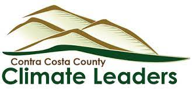
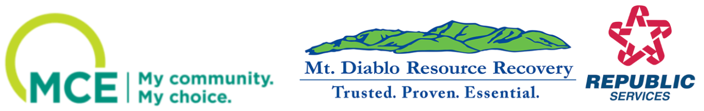

```{r setup, include=FALSE}
knitr::opts_chunk$set(echo = TRUE)
```

```{r, include=FALSE}

library(tidyverse)
library(ggplot2)
library(plotly)
library(dplyr)
library(htmlwidgets)
library(jsonlite)
library(leaflet)
library(janitor)
library(ggthemes)
library(plotly)
library(rjson)
library(tidyverse)
library(ggplot2)
library(plotly)
library(readxl)
library(lubridate)
```

# **Introduction**
As the global community increasingly recognizes the urgent need for sustainable waste management practices, local jurisdictions have become essential players in addressing this complex issue. Contra Costa County, nestled in the heart of California, is no exception. With a commitment to preserving its natural resources and enhancing the quality of life for its residents, the county has implemented a range of waste policies and programs to manage its waste effectively.

This scorecard provides a comprehensive overview of Contra Costa County's waste management policies and data, focusing on key metrics such as disposal rates, the number of programs local jurisdictions have implemented, recycling rates, beneficial reuse initiatives, and the distance trash has to travel to reach a landfill. By examining these metrics, we gain insight into the county's efforts to reduce waste, promote recycling, and minimize its environmental impact.
    
All data used is sourced from publicly available data sets, ensuring transparency and accountability. 

# **Important Waste Criteria**

```{r, echo=FALSE, fig.align = 'center'}
fig_multi <- readRDS(file = "waste_main.rds")
fig_multi
#096
```

# **Total Tonnage**


```{r, echo=FALSE, fig.align = 'center'}
total_tonnage <- readRDS(file = "total_tonnage.rds")
total_tonnage

```
This graph show total tonnage delivered to landfills by each jurisdiction. It is important to remember each jurisdiction is of different sizes.

# **Where are the Landfills in Contra Costa County**
```{r, echo=FALSE, fig.align = 'center'}
waste_map <- readRDS(file = "091_waste_map_ccc.rds")
waste_map
#091
```


# **How is Waste Produced**

```{r, echo=FALSE, fig.align = 'center'}
plot_business_groups <- readRDS(file = "plot_business_groups.rds")
plot_business_groups
```
Different businesses produce different types and amounts of waste. This data is from a 2014 study by CalRecycle.

# **How Waste can be used**

Beneficial reuse is a waste management practice that involves finding new and valuable applications for materials that would otherwise be discarded. It is a concept that emphasizes the importance of using resources efficiently and sustainably, with the goal of reducing waste and environmental impact. In the context of Contra Costa County's waste management policies, beneficial reuse could involve repurposing materials such as construction and demolition debris, organic waste, or industrial byproducts for other beneficial purposes. Beneficial reuse is a controversial topic with some suggesting it is largely greenwashing.

```{r, echo=FALSE, fig.align = 'center'}
plot_reuse <- readRDS(file = "plot_reuse.rds")
plot_reuse
```

Data on other methods of use like methane capture and composting will be explored when data becomes available.

# **Statewide Enforcement**

CalRecycle, the California Department of Resources Recycling and Recovery, is responsible for overseeing and enforcing waste management regulations in California, including Contra Costa County. It has a range of enforcement actions at its disposal to ensure compliance with waste management laws and regulations
```{r, echo=FALSE, fig.align = 'center', warning=FALSE,  error=FALSE, message=FALSE, }
enforcement <- readRDS(file = "enforcement.rds")
enforcement
```
# **Where does your Waste Go**
```{r, echo=FALSE, fig.align = 'center'}
waste_map_2 <- readRDS(file = "091_waste_map.rds")
waste_map_2
#091
```
The size of the circles indicate the amount of waste sent to each facility by Contra Costa residents. Zoom in!

# **Data Description and Citation**

The data used in this analysis includes the following:

Programs
https://www2.calrecycle.ca.gov/LGCentral/DiversionProgram/ProgramCountSummary


If you have any questions or comments about this report or the data sources used, please feel free to reach out to the author at info@cccclimateleaders.org


# **Our Sponsors**

